# 🍕 Pizzaro — сервис онлайн-заказа пиццы

**Next.js 15 · React 19 · TypeScript · Prisma · SQLite**

Полноценное full-stack приложение с клиентской частью, админ-панелью, авторизацией, конфигуратором пиццы и оформлением заказов 

---

## 🚀 Быстрый запуск


### 1. Клонируем проект
```bash
git clone git@github.com:Alephod/Pizzaro-project.git
```

### 2. Копируем пример .env
```bash
cp .env.example .env
```

### 3. Настройка .env
```env
# URL API 
NEXT_PUBLIC_API_URL=http://localhost:3000/api

# Секрет для NextAuth (можно оставить как есть)
NEXTAUTH_SECRET=8f0177251bbad111071038c5412cdc11ac3a5f4b55d8677e5d962e45c5e262134cda1ec74a3b320f70c9de29518ec407

# Для отправки писем
# EMAIL_HOST=smtp.mailersend.net
# EMAIL_PORT=587
# EMAIL_SECURE=false
# EMAIL_USER=...
# EMAIL_PASS=...
```

### 4. Установка зависимостей и сборка UI-библиотеки
```bash
cd ui-library
npm install
npm run build
cd ..
```

### 5. Установка зависимостей для Next.js
```bash
cd ../frontend
npm install
```

### 6. Создание базы SQLite
```bash
# Применение миграций
npx prisma migrate dev --name init
```
```bash
# Инициализация админ пользователя
npx prisma db seed
```

### 7. Запуск проекта
```bash
npm run dev
```

Откройте в браузере:
- Клиентская часть: [http://localhost:3000](http://localhost:3000)  
- Админ-панель: [http://localhost:3000/admin](http://localhost:3000/admin)

---

## 🔑 Данные администратора

```
Логин:    admin
Пароль:   supersecret
```

---

## 📦 Полезные команды

```bash
# Открыть базу в удобном GUI (браузер)
npx prisma studio

# Пересоздать базу с нуля (удалит все данные!)
npx prisma migrate reset --force
npx prisma db seed

# Линтер и тесты
npm run lint
npm run lint:fix

npm run test
npm run test:coverage

# Сборка для продакшена
npm run build
npm run start
```

---

## 🏗 Стек технологий

- Next.js 15
- React 19
- TypeScript
- Prisma ORM
- SQLite
- NextAuth.js
---


## 🛠 Функциональность

### Клиентская часть
- Меню с категориями
- Конфигуратор пиццы (размер, тесто, добавки, удаление ингредиентов)
- Корзина с локальным хранением
- Оформление заказа
- Личный кабинет и история заказов
- Отслеживание статуса заказа в реальном времени

### Админ-панель
- Управление категориями и товарами
- Загрузка изображений
- Редактирование вариантов и добавок
- Просмотр и обновление статусов заказов


# Примеры использования
## Админ-панель
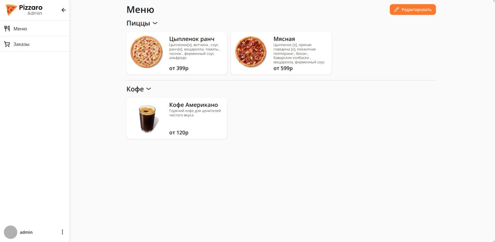

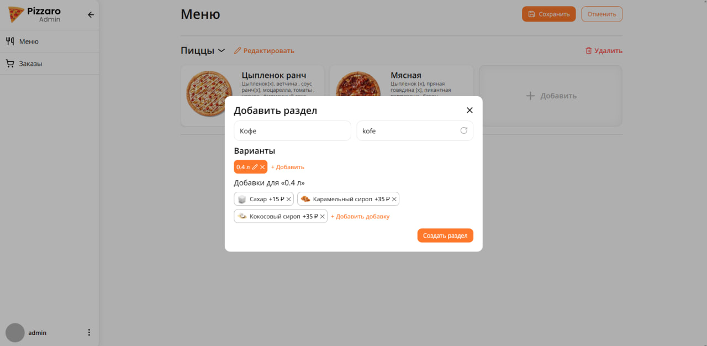
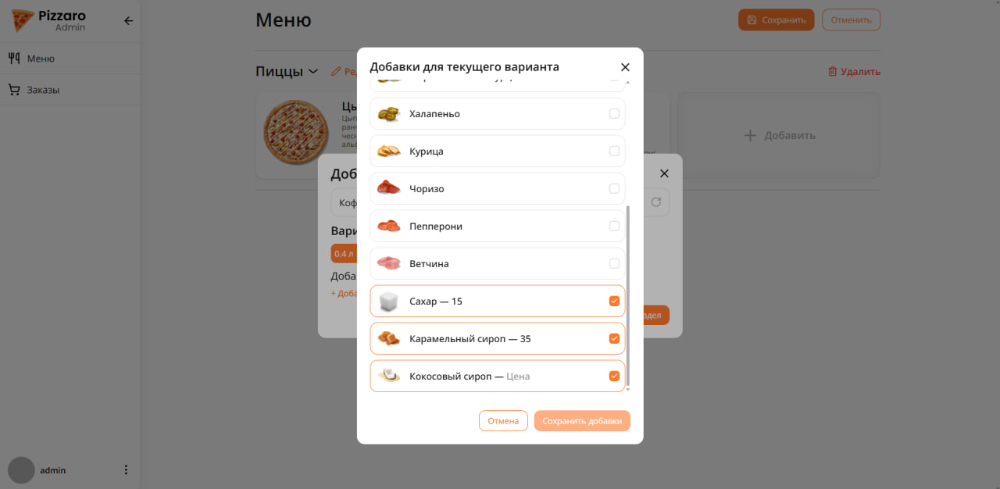

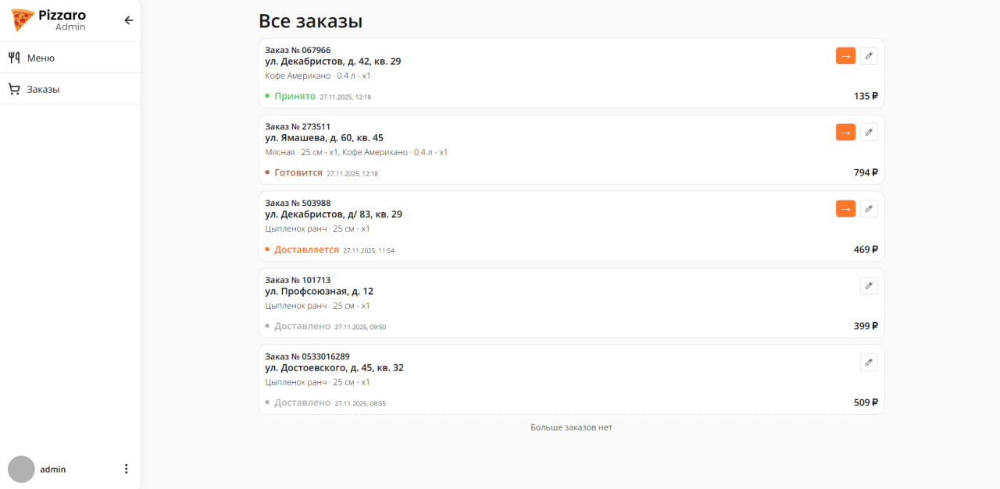

## Клиентская часть
Просмотр меню и добавление в корзину
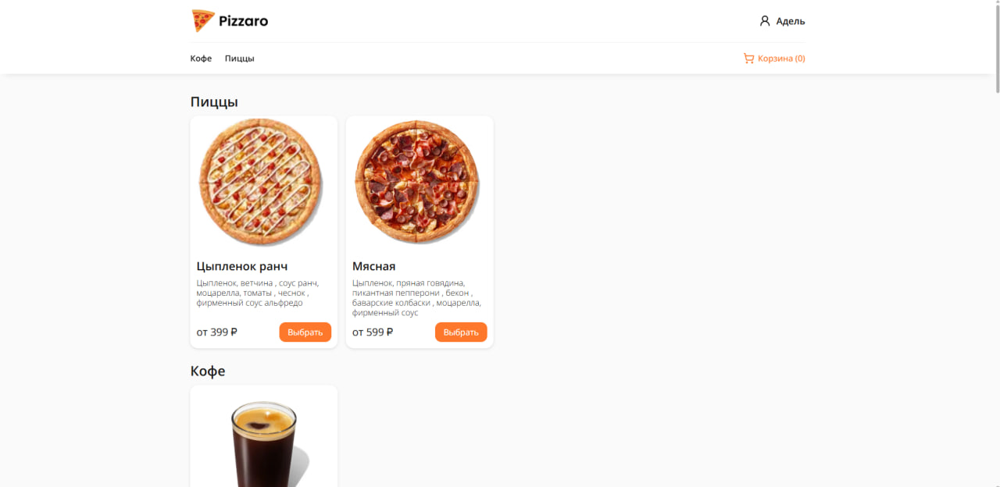
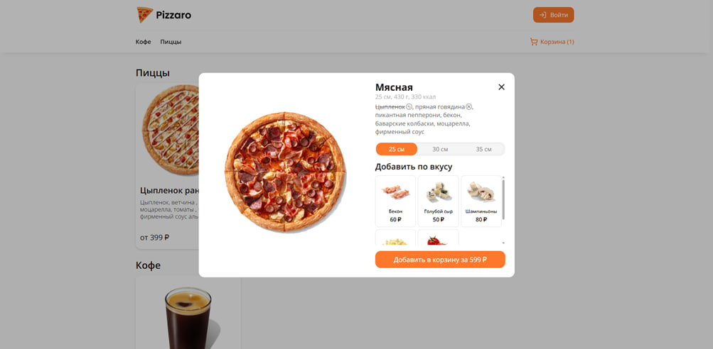
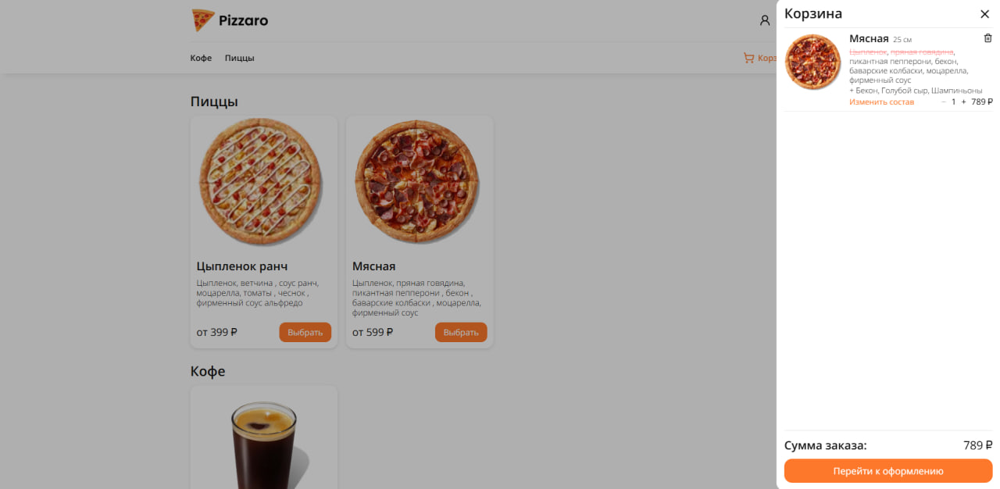
Оформление заказа
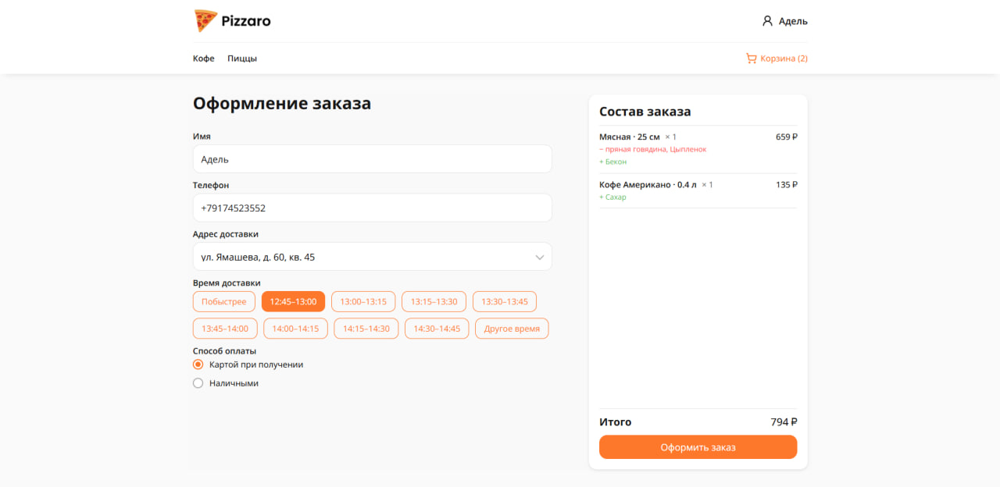
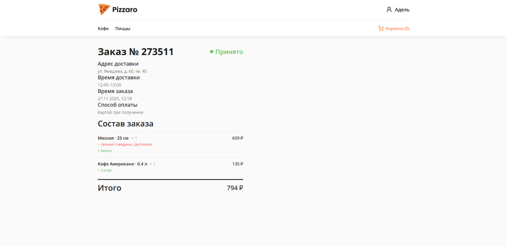
Авторизация
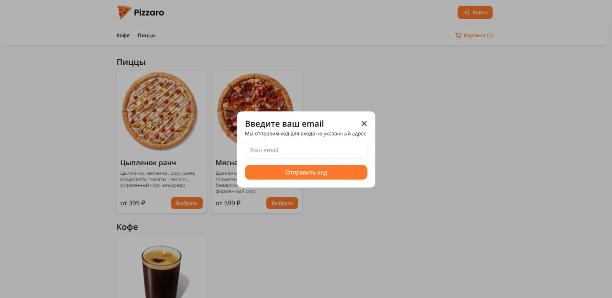
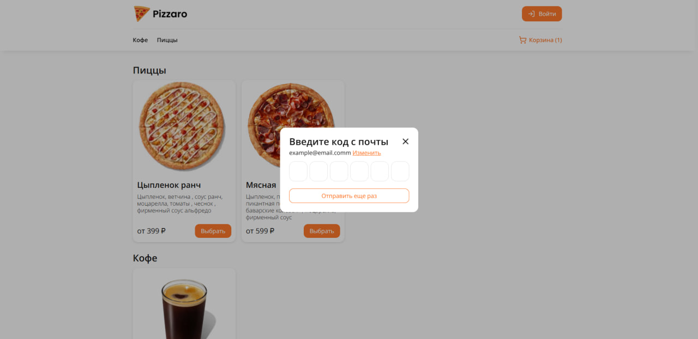
Профиль пользователя
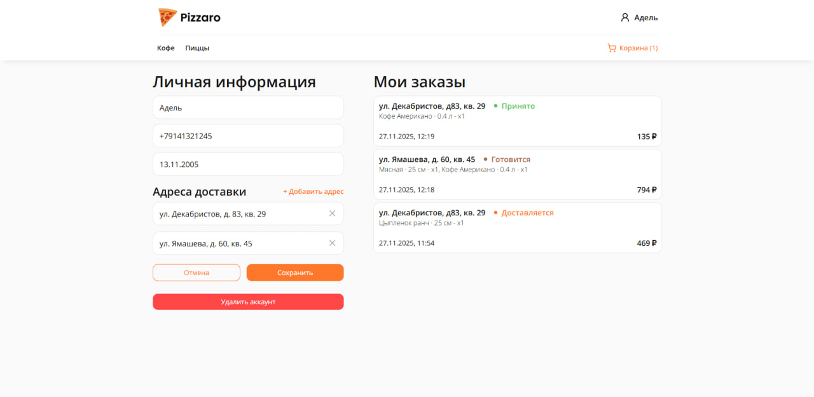
